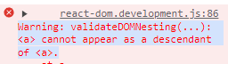
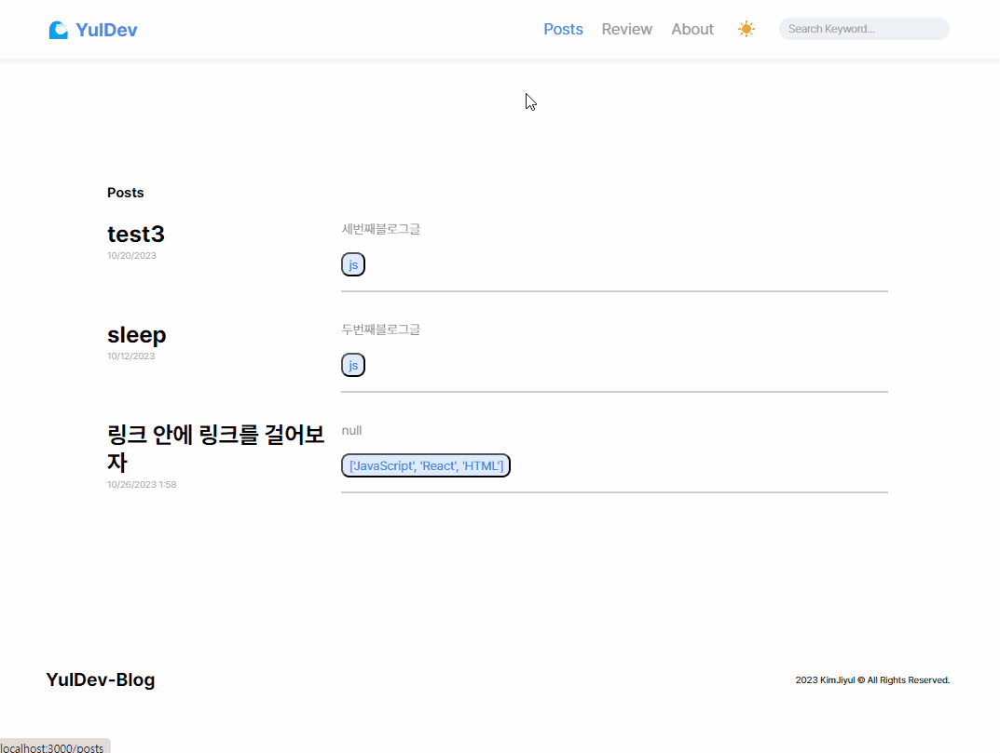
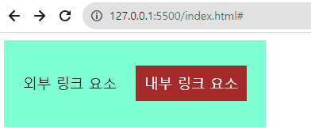
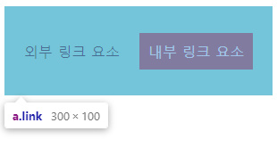
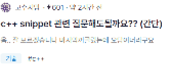

> 💡 해당 글은 React 18, react-router-dom 6 버전을 기반으로 쓰였습니다.

## 🏷️ 링크 태그 안에 링크 태그를 넣고 싶었다

블로그 글 리스트는 자동으로 화면에 뿌려지게 코드가 짜여 있다.

```jsx
// post 예시 {id: 1, tags: 'JavaScript', ...}

<Link to={`posts/${post.id}`}> // Link는 a 태그로 변환됩니다.
 <span>{post.tags}</span>
</Link>
```

이후 태그들을 모아보거나 태그만 있는 글을 볼 수 있도록 `tags 라우터`를 정리했고, Post List에 있는 태그들도 태그 이름에 맞는 라우터로 가게끔 **코드를 수정**해야 겠다는 생각을 했다.

즉, `Link (= a 태그) 안에 Link 태그를 **중첩**`으로 사용해야겠다는 간단한 생각으로 부터 문제는 발생했다.

## 🏷️ Link 태그 중첩으로 인한 문제 발생

```jsx
<Link to={`posts/${post.id}`}>
 <Link to={`tsgs/${post.tags}`}>
  <span>{post.tags}</span>
 </Link>
</Link>
```

Link 안에 Link를 넣는 것쯤이야, 무슨 문제 있겠어? 라고 대수로이 생각했던 나는 하나의 에러 메세지를 마주했다.

### Warning: validateDOMNesting(...): `<a>` cannot appear as a descendant of `<a>`



직역하자면 `위험!!! 검증DOM중첩(…): <a>는 <a>의 자손으로서 나타날 수 없습니다.` 즉, **중첩된** a태그는 사용이 **불가능**하다는 것입니다.


## 🏷️ 다 울었니? 해결해야지

### 1. 하위 a태그를 button 태그로 변경

> 참조 링크: <https://stackoverflow.com/questions/66735767/react-router-domreactjs-nesting-link-components>

나와 같이 `Link`태그에 또다시 `Link` 태그를 중첩으로 쓰고 싶어하는 분의 글을 보았다.

그리고 달린 답변을 해석해 보자면,

>📌 당신은 a 태그는 a 태그의 자손으로서 나타날 수 없다는 경고를 봤다.
>
>이것을 고치기 위해선, 당신은 Link 태그(=앵커 태그)와 button 태그를 사용할 수 있고, ... (CSS로도 속임을 할 수 있다는 내용)
>
>그리고 버튼 onClick에 `preventDefault`와 `stopPropagation`을 사용해라.

라는 내용으로, `<a>`태그 안의 하위 태그는 `<button>` 태그로 대체해서 쓰라는 이야기이다.

그래서? 수정해 봤다.

```jsx
<button
  className="tags"
  onClick={(e) => {
    e.preventDefault();
    e.stopPropagation();
    window.location.href = `/tags/${post.tags}`;
  }}
>
  {post.tags}
</button>
```

#### 무의미한 로딩 발생



서버 응답이 2~3초 걸리는 기이한 현상이 생긴다. (참고로 `Link` 태그로 라우팅을 구현할 경우 SPA답게 바로바로 화면 전환이 된다.)

* 10/26/2023 기준 이유를 찾지 못했습니다. 이유를 아시는 분은 `yul.dev.k@gmail.com`으로 내용을 공유해 주시면 감사드리겠습니다.

위 방법은 꼼수로 쓰인 것이 아닐까?.<br>
[a 태그는 대화형 콘탠츠가 없어야지 전체 단락, 목록 등을 둘러쌀 수 있기 때문이다.](https://stackoverflow.com/questions/6393827/can-i-nest-a-button-element-inside-an-a-using-html5) 원래라면 작동이 되지 않는 게 맞는 코드라는 것이다.

내 의도대로 수정은 됐지만, 사이드 이펙트가 발생한 것과 다름이 없다고 판단했다.

### 2. 대체 card 안에 링크들은 어떻게 거는 거야 🥶


분명 다른 사이트들을 보면 CARD 컴포넌트 안에 있는 프로필 이미지를 누르면 프로필 페이지로 넘어간다던가, 태그들을 클릭하면 태그들만 보여주는 리스트 페이지로 넘어가던데 . . .
<br>이게 시니어들의.. 짬..?

세삼 시니어 분들을 존경하게 됐다.

아무튼, 여러 가지를 구글링 하다 보니 [링크 안에 링크 넣기](https://nuli.navercorp.com/community/article/1132798) 라는, 딱 내가 원하던 제목이 눈에 들어왔다.

> (참고) 해당 아티클이 담긴 사이트는 네이버 사의 `널리` 라는 사이트로 네이버 제공 웹 표준 가이드, 웹 접근성 프로젝트, 마크업 코딩 노하우, 개발자 채용, 세미나 정보 안내해 준다고 한다.

해당 아티클에선 총 4가지의 방법을 제시해 준다. 우리는 각 예시들로 아래와 같이 원활한 페이지 전환을 해볼 것이다.



> 올려주신 codepen은 사이트 특성 상 가독성이 좋지 않았고, 한 번에 세 개의 예제가 담겨 있어 파악하기가 조금 어려웠습니다. 그래서 각 예제 별로 코드펜을 임베드 해두었으니 참고 바랍니다.

#### a. 링크 안에 링크가 있는 디자인을 없앤다

* 해당 방법은 디자인 프레임을 갈아엎어야 했기에 패스했다.

#### b. 외부 링크는 별도의 링크로 영역을 덮은 뒤, 내부 링크는 z-index를 이용한다

1. 위 내용을 `HTML` 코드로 풀어 보자.
<br>외부 링크 요소인 `div 태그`는 `google` 라우터로, 내부 링크 요소인 `a 태그`는 `stackOverFlow` 라우터로 향하게 해보자.

    ```JavaScript
    <section class="outer">
      외부 링크 요소
      <div class="info">
        <a href="https://google.com" class="inner">
          <span>내부 링크 요소</span>
        </a>
      </div>
    </section>
    ```

2. 여기서 의문이 들것이다. 그럼 `.outer`의 **하이퍼링크**는 어디에 걸어줘야 하는 것일까? `addEventListener`의 `click 이벤트`로 `window.location.assign` method를 이용하는 것이 좋을까?
  <br>

    <br>assign 메서드로도 충분히 페이지 이동이 가능하다. 해당 내용은 [c. 외부 링크를 JS를 이용하여 작동하도록 구성](#c-외부링크를-js를-이용하여-작동하도록-구성)에서 다룬다.
    <br>
    <br>
    이번에는 JS 사용하지 않아도 _HTML과 CSS_ 로만 가능하게 해볼 것이다.

    ```JavaScript
    <section class="outer">
      ... //.info .inner span
      <a href="https://stackoverflow.com/" class="link"></a>
    </section>
    ```

    `.outer` 안에 `a 태그`를 만들어 `.outer .link`의 구성을 만든 뒤, `section`을 선택하면 `stackOverFlow`라우터에 연결되도록 한다.

    이쯤에서 해당 방법의 제목을 다시 곱씹어 보자.
    > ① 외부 링크는 별도의 링크로 영역을 덮은 뒤, <br>
    > ② 내부 링크는 z-index를 이용한다.

    <br>

    즉, 우리는 방금까지 ①번의 내용을 완료한 것이다. 그럼 이제 `CSS`로 ②번의 내용만 해결해 주면 된다는 것이다.

    <br>

    ```CSS
    <!-- 꼭 중요한 내용만 적겠습니다. 자세한 코드는 codePen 참고 해주세요. -->
    .outer {
      position: relative;
    }
    .inner {
      position: relative;
      z-index: 10;
    }
    .link {
      position: absolute;
      top: 0;
      left: 0;
      right: 0;
      bottom: 0;
    }
    ```

    > **⚡TMI**
    >
    > `.inner`에도 `position: relative;`가 들어간 이유는, `z-index`가 적용되려면 해당 요소가 `position 의 relative, fixed, absolute 중에 하나의 값`을 가지고 있어야 하기 때문이다.

    `.inner`의 `z-index` 값을 올려서 .`outer && .link` 선택이 걸리지 않게끔 한다.

    `.outer`의 `postion` 값을 `relative`로 준 이유는, `.link`가 `.outer`를 그대로 **덮어야** 하기 때문이다. 그래서 `.link`의 `postion이 absolute`로 들어간 것이다.

    

##### [🌊 codePenLink](https://codepen.io/yul-dev-k/pen/xxMwxLX)

#### c. 외부링크를 JS를 이용하여 작동하도록 구성

   1. HTML 구성

      ```JavaScript
      <section class="outer">
        외부 링크 요소
        <div class="info">
          <a href="https://google.com" class="inner">
            <span>내부 링크 요소</span>
          </a>
        </div>
      </section>
      ```

      [b. 외부링크는 별도의 링크로 영역을 덮은 뒤, 내부 링크는 z-index를 이용한다](#b-외부링크는-별도의-링크로-영역을-덮은-뒤-내부-링크는-z-index를-이용한다)와 다른 점은, `.outer`의 `a태그`를 숨기는 듯이 (?) 만들지 않아도 된다는 것이다.

   2. `querySelector`를 이용해 DOM 요소 접근 후  `eventListener` 연결

      우리는 이제 `eventListener`를 연결해 페이지 이동을 도모해볼 것이다.
      <br>
      <br>
      `.outer`를 가져오기 위해 DOM 요소를 가져오는 `querySelector`를 이용해 `.outer`를 가져온다.

      ```JavaScript
      const outer = document.querySelector(".outer");
      ```

      `상수 outer`에게 `addEventListener`를 통해 `eventListener`를 연결해 준다.

      ```JavaScript
      outer.addEventListener("click", () => )
      ```

   3. `outer eventListener`에 `window.location.assign()` 메서드 이용해서 개발자 지식의 공간인 stackOverFlow로 페이지를 이동할 수 있는 걸 볼 수 있다.

      ```JavaScript
      outer.addEventListener("click", () =>   
        window.location.assign("https://stackoverflow.com/");
      );
      ```
  
  놀랍게도 코드는 이게 끝이다. b 섹션에선 `HTML`에 불필요하게 태그를 만들어 주고, `CSS`에선 `postion` 까지 신경 쓰며 까다롭게 만들던 것이 `JavaScript`에선 **단 네 줄**에 끝나는 것이다.

##### [🌊 codePenLink](https://codepen.io/yul-dev-k/pen/GRzpgxZ)
  
#### d. b + c의 결합 형태

나는 [c. 외부 링크를 JS를 이용하여 작동하도록 구성](#c-외부링크를-js를-이용하여-작동하도록-구성)만을 생각했는데, 해당 아티클의 필자인 '유무'님의 말씀에 따르면
> html만 보고 있으면 외부 영역이 링크인지 전혀 알 수 없게 됩니다.

라고 하시며 `사용자 접근성`까지 섬세히 신경 쓰시는 모습을 볼 수 있었다. <br>그렇기에 이제 마지막 방법인, b와 c의 결합 형태를 통해 사용자에게 '여기도 클릭 되는 부분이고, 여기도 클릭 되는 부분이야!'를 직관적으로 전달할 수 있게 된다.


(차후 시니어가 된다면 이런 섬세함까지 겸비한 사람이 되어야겠다는 생각을 하게 하셨습니다. 존경합니다.)

이제 코드를 짜보자면, <br>
b와 c의 코드가 짬뽕이라 생각하면 되겠다.

##### [🌊 codePenLink](https://codepen.io/yul-dev-k/pen/JjxYoaq)

## 🏷️ 새로운 접근 방식을 찾다

이 글을 쓰면서 이렇게까지 컴포넌트 안에 a 태그를 중첩으로 써야 할까? 라는 의문이 들었다.



대한민국 개발자라면 대부분 알, 개발자 커뮤니티 `OKKY`의 UI, UX를 보니 Title, Summary, Tag, Profile 등등.. 을 모두 나누어 둔 것을 볼 수 있다.
<br>이렇게 하면 위와 같은 문제를 봉착하지 않아도 될 수 있을 뿐더러, 사용자의 마우스가 hover를 통해 각 요소 어디에 위치해 있으며 직관적으로 이걸 클릭하면 이런 링크로 가겠구나가 머리에 그려지기 때문이다.

호기롭게 시작한 이 글의 주제와는 다르게, 나는 위 방법으로 코드를 바꾸려고 한다.
예기치 못한 사이드 이펙트를 방지하기도 위한 이유도 있고, 무엇보다 사용자의 편의성을 위해서이다.

## 🏷️ 마치며

개발을 하면서 배우는 가장 큰 교훈 중 하나는 '완벽한 것은 없다'이다.

a 태그 안에 a 태그를 넣고 싶다는 생각 하나로 이걸 해결하기 위해 이 코드를 개선해줄 완벽한 답안을 찾았고, 그 결과 '**유무**'님의 글까지 닿게 되었다.
그러다 문득 방문한 `OKKY` 커뮤니티의 post list 구성을 보면, 내가 생각한 방법과는 다른 방식을 사용하여 하위 컴포넌트에 접근할 수 있게 한 것을 볼 수 있었다. 이러한 접근은 사용자 측면에서 더 나은 편의성을 보여주었다.
즉, 애초에 정답 따윈 없었다.

쉽게만 살아가면 재미없다고 터틀맨이 말한 것처럼, 완벽한 정답 따윈 없는 쉽지만은 않은 인생 속에서 더 나은 것을 만들어 가는 개발자가 되려 한다.
